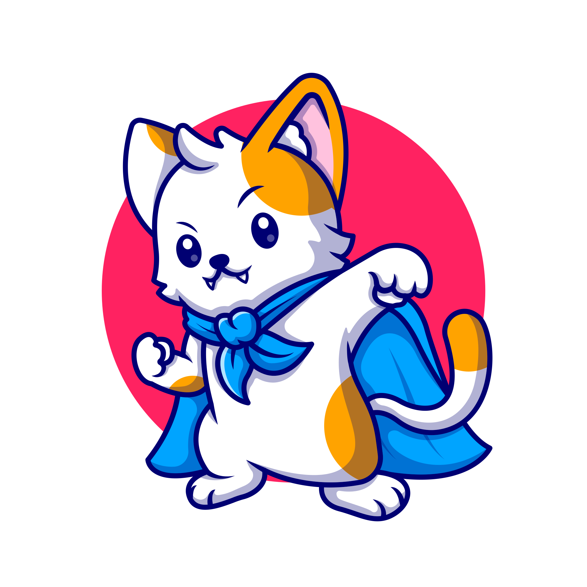

# Misophonia Mask



**[Open the app in your browser](https://cgjennings.ca/live/misophonia-mask/)**

## What is misophonia?
Misophonia, also called selective sound sensitivity syndrome, is a disorder characterized by decreased tolerance to the perception of certain sounds.
When these sounds are perceived by an individual with misophonia, they trigger an extreme emotional response.
This reaction may manifest as extreme irritation, anger, disgust, or a fight-or-flight response.
The reaction is physiological rather than psychological; it is not possible to build up a tolerance to trigger sounds by repeated exposure.
Trigger sounds vary by individual and can change over time, but typical examples include chewing, loud breathing, finger tapping, or the sound caused by the friction of certain surfaces rubbing together (for example, skin or clothing).
Because trigger sounds are so commonly encountered, those with misophonia may have difficulty participating in everyday activities such as family meal time or school.
There are currently no evidenced-based treatments for misophonia.

## What is the Misophonia Masking App?
The [Misophonia Masking App](https://cgjennings.ca/live/misophonia-mask/) is a Web app that can play sound that may help mask out trigger sounds.
You can load it in your browser like a regular Web page.
You can also, if your device and browser support it, *install* it onto your device like a standard app.
There are two benefits to installing it: first, it is readily available when you want to use it, since you only need to open the app; and second, it will work even when your device is offline.

The app is designed to be discrete, to load quickly, to be fast and easy to activate, and to minimize how much the audio drains your battery. It shows no ads or other external content, and it doesn't track users or take any similar action that might cause parents any concern about use by young children. (Misophonia symptoms typically begin around ages 9&ndash;12.)

### How do I use it?

The app should be compatible with the latest version of most popular browsers.

1. [Open the page.](https://cgjennings.ca/live/misophonia-mask/) Or, if you have installed it as an app, open the app on your device.
2. Choose one of the coloured circles to produce that "colour" of noise (see below for details).
3. Once the sound starts playing, begin the potentially triggering task(s). Headphones or earbuds will work better than playing the sound out of your device's built-in speaker. For best results, use headphones with active noise cancelling technology.
4. Choose the black circle for silence.

You can also use the app to play masking background noise generally when in an environment where triggers are common or expected.

### What is a "noise colour"?

Each noise colour varies in how loud some pitch ranges (frequencies) within the noise are. For some colours, lower frequencies may be louder, and for others, higher frequencies. The list below describes each button colour in the order it appears:

**Black (silence)**  
The black button with the muted speaker icon stops playing noise.

**White (1)**  
White noise contains equal *energy* at all frequencies. However, because human hearing is more sensitive to some frequencies than others, some frequencies will be *perceived* as being louder than others.

**Grey (2)**  
Grey noise is white noise that has been adjusted, using a *psychoacoustic model*, so that all frequencies sound equally loud. (The grey noise produced by the app is approximate. True grey noise is unique for each listener.)

**Red (3)**  
Red noise, also called brown noise, is progressively quieter at higher pitches (by 6&nbsp;dB per octave). It sounds softer than other colours, and is comparable to the sound of a distant waterfall.

**Pink (4)**  
Pink noise falls between white and red noise. Like red noise it gets quieter at higher pitches, but not by as much. The sound is comparable to the sound of a nearby, roaring waterfall.

**Green (5)**  
Green noise simulates the ambient background noise of nature, without any human-made sounds. It is similar to pink noise.

**Blue (6)**  
Blue noise is roughly the high frequency counterpart of pink noise. Instead of getting quieter at higher pitches, it gets louder at high pitches, but not as as much louder as purple noise. The sound is comparable to heavy rain.

**Purple (7)**  
Purple, or violet, noise is progressively louder at higher pitches (by 6&nbsp;dB per octave, like a reverse red noise). It sounds harsher than other colours, and is comparable to the hiss of a spray can.

**Black (custom)**
The black button with the slider icon allows you to customize which which frequency ranges are emphasized.
Choosing it will play white noise, but also display a set of sliders.
Each slider covers a different frequency range, from lowest (at the top) to highest (at the bottom).
When the slider knob for a range is in the middle, that frequency plays at standard volume.
Move the knob left to make those frequencies quieter; to the right to make them louder.
Choosing **Reset** will reset all the sliders to the middle position.

### What colour should I use?
The colour that works best for a given listener or trigger may vary, so you should experiment. That said, a good place to start is often red (3), pink (4), or green (5). Red noise is often used for relaxation or to help fall asleep, and there are anecdotal reports that it may also work well to block many trigger sounds. Pink noise may work better when using a small speaker rather than headphones. Pink and green noise are similar, but you may find you prefer one over the other.

### How do I install it?
To install Misophonia Mask as an app on your device, look for an icon in the upper-right corner of the page.
In some browsers, this icon won't appear until you interact with the page at least once (just touch or click somewhere).
If the icon does not appear, then either the app is already installed or else your browser does not support installing Web sites as apps.
Note that on macOS (Mac desktops and notebooks), Safari does not support Web apps, but Chrome does.
Safari does support installing Web apps on iOS (iPhones and iPads).

You can also install the app by clicking on the "About this app" link, then the "install this page as an app" link.

Once installed, your browser may display a message stating that it was "added to your home screen".
This message is sometimes misleading.
It may or may not be added to your home screen, but it will be included in your device's apps.
For example, the Start menu on Windows, the "All Apps" page on Android, or the App Library on iOS.

**Note:** if your phone has antivirus software installed, you may get a notification about it having a "low reputation" or something similar.
This just means that the app is installed on a relatively small number of devices.
When installed as an app, Misophonia Mask is no more dangerous than it is when used as a Web page.
It still runs under all of the security protections provided by your browser, and its behaviour is the same.

# "Building" from source
This app is simple enough that there is no need for a build tool.
It is written in plain, modern JavaScript, CSS, and HTML and should run in about 90–95% of installed browsers at the time this was written.
You are free to add a build tool if you like, but for development it is sufficient to do something like the following (assumes Node.js is installed):

```bash
npx browser-sync app -w
```

# Additional credits
[Heroic cat image](https://www.freepik.com/free-vector/cute-cat-super-hero-cartoon-icon-illustration-animal-hero-icon-concept-isolated-flat-cartoon-style_13874643.htm)
adapted from an image by catalyststuff on Freepik.

Where possible, audio is played from clips rather than generated dynamically, as this is expected to consume less battery power.
The clips are originally from [Wikipedia](https://en.wikipedia.org/wiki/Colors_of_noise).
Except for green noise, the clips were generated by user Omegatron.
The white and grey noise are public domain, while the remainder are under a
[Creative Commons Attribution-Share Alike license](https://creativecommons.org/licenses/by-sa/3.0/deed.en).
The green noise clip was generated by user Tashotakoe and was released into the public domain.

# Disclaimer
Nothing on this page or in the app should be construed as medical advice or a medical claim.
If you have questions or concerns about your health, consult a qualified medical professional.